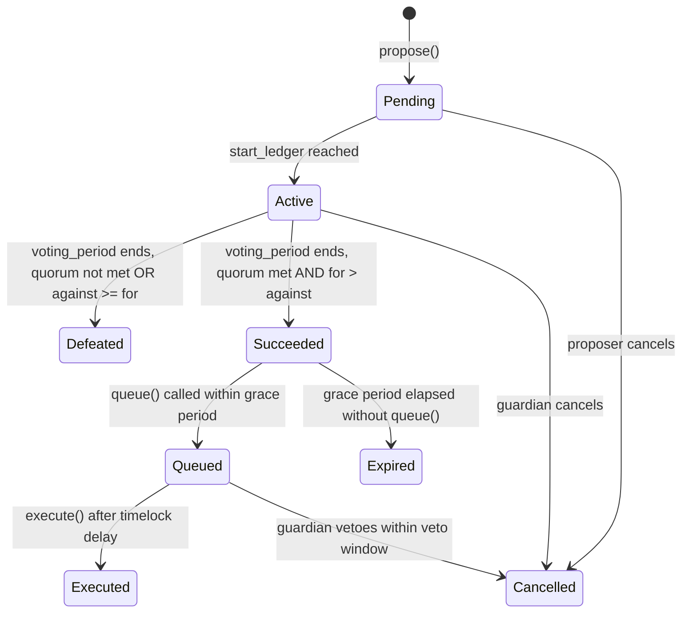

# Proposal State Machine

The governor contract manages proposals through 8 distinct states, each with specific entry conditions, valid actions, and exit transitions.

## State Diagram

---

## Pending

**Entry Condition**: Proposal created via `propose()` but `voting_delay` ledgers haven't passed yet.

**Valid Actions**:
- `cancel()` — proposer can cancel at any time before voting starts
- Update metadata URI

**Exit Conditions**:
- `start_ledger` reached → transitions to **Active**
- Proposer calls `cancel()` → transitions to **Cancelled**

**Storage Changes**: None (proposal just created)

---

## Active

**Entry Condition**: `start_ledger` reached and voting period has begun.

**Valid Actions**:
- `cast_vote()` — any token holder with voting power
- `queue()` — can only be called after grace period if proposal succeeded
- `cancel()` — guardian can cancel during active voting

**Exit Conditions**:
- Voting period ends, quorum **not met** OR `against >= for` → **Defeated**
- Voting period ends, quorum **met** AND `for > against` → **Succeeded**
- Guardian calls `cancel()` → **Cancelled**

**Storage Changes**:
- `voted[address]` — vote records stored
- `votes_for`, `votes_against`, `votes_abstain` — accumulate

---

## Defeated

**Entry Condition**: Voting period ended without reaching quorum OR majority against.

**Valid Actions**: None (read-only)

**Exit Conditions**: None (terminal state)

**Storage Changes**: None

---

## Succeeded

**Entry Condition**: Voting period ended with quorum met AND `for > against`.

**Valid Actions**:
- `queue()` — anyone can queue (must call within grace period)
- `cancel()` — guardian can still cancel before execution

**Exit Conditions**:
- `queue()` called within grace period → **Queued**
- Grace period elapsed without `queue()` → **Expired**

**Storage Changes**: `succeeded = true`

---

## Queued

**Entry Condition**: `queue()` called within grace period after success.

**Valid Actions**:
- `execute()` — can only execute after timelock delay passes
- `cancel()` — guardian can veto within veto window

**Exit Conditions**:
- `execute()` after timelock delay → **Executed**
- Guardian vetoes within veto window → **Cancelled**

**Storage Changes**: `queued = true`

---

## Executed

**Entry Condition**: `execute()` called after timelock delay.

**Valid Actions**: None (terminal state)

**Exit Conditions**: None

**Storage Changes**: `executed = true`, on-chain actions dispatched to target contracts

---

## Cancelled

**Entry Condition**: Cancelled by proposer, guardian, or veto.

**Valid Actions**: None (terminal state)

**Exit Conditions**: None

**Storage Changes**: `cancelled = true`

---

## Expired

**Entry Condition**: Grace period elapsed without `queue()` being called.

**Valid Actions**: None (terminal state)

**Exit Conditions**: None

**Storage Changes**: None

---

## State Summary Table

| State | Entry Action | Exit Actions | Terminal? |
|-------|------------|------------|----------|
| Pending | propose() | vote start / cancel | No |
| Active | start_ledger | defeat / succeed / cancel | No |
| Defeated | voting result | — | Yes |
| Succeeded | voting result | queue / expire | No |
| Queued | queue() | execute / cancel | No |
| Executed | execute() | — | Yes |
| Cancelled | cancel() | — | Yes |
| Expired | timeout | — | Yes |

---

## Related

- Governor contract: `contracts/governor/src/lib.rs`
- State function: `state()` returns current `ProposalState`
- [Architecture](./architecture.md)